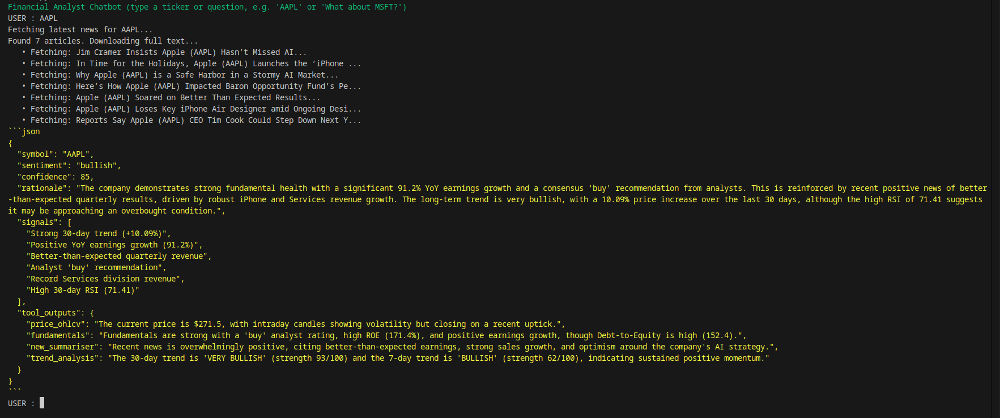
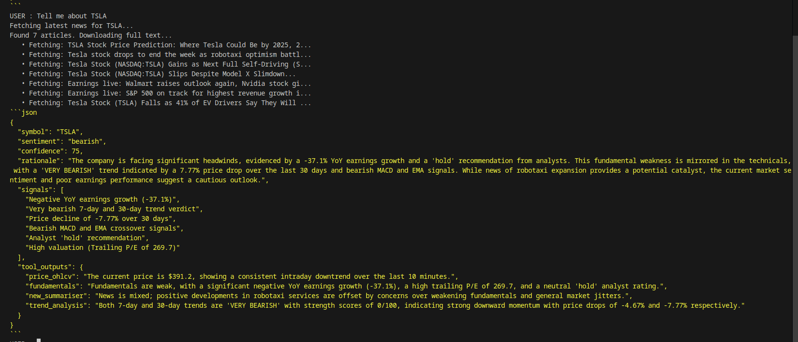

# Stock Analysis Chatbot

This project implements a sophisticated stock analysis chatbot designed to provide comprehensive insights and recommendations for stock tickers or companies. Leveraging a suite of specialized tools, the chatbot gathers real-time market data, fundamental company information, recent news, and trend analysis to generate a concise, evidence-based sentiment.

## Features

- **Real-time Market Data (price_ohlcv):** Fetches the most recent market price and OHLCV (Open, High, Low, Close, Volume) data. It prioritizes intraday data (last 10 minutes/candles) and falls back to daily candles if intraday is unavailable.
- **Fundamental Analysis (fundamentals):** Gathers rich fundamental data from Yahoo Finance, including company information (sector, industry), valuation metrics (P/E, market cap), profitability (margins, ROE), growth rates, financial health (debt, cash), and more.
- **News Summarization (new_summariser):** Collects fresh, Google-trending news articles related to the specified stock using Serper.dev. It then downloads the full text of these articles and uses Groq's advanced LLM (llama-3.3-70b-versatile) to generate a concise, investment-relevant summary, highlighting price-moving events, numerical highlights, sentiment signals, and risks/catalysts.
- **Trend Analysis (trend_analysis):** Performs technical trend analysis using 7-day or 30-day hourly OHLCV data. It calculates various technical indicators such as EMA crossovers, MACD, RSI, Bollinger Bands, and volume trends to provide a trend verdict and confidence score.
- **AI-Powered Recommendations:** Synthesizes outputs from all tools into a final recommendation with a sentiment (bullish, bearish, neutral), confidence score, detailed rationale, and key signals in a structured JSON format.

## Architecture

The chatbot is built using `langgraph` for managing the conversational flow and tool orchestration.

- **StateGraph:** Defines the graph structure, connecting different nodes.
- **Chatbot Node:** An LLM node that integrates with Google Generative AI (gemini-2.5-pro) and binds all financial tools. It's responsible for processing user input, calling tools, and generating the final response.
- **ToolNode:** A prebuilt `langgraph` node that executes the defined financial analysis tools (`price_ohlcv`, `fundamentals`, `new_summariser`, `trend_analysis`).
- **Router Node:** Directs the graph flow. If the LLM response includes tool calls, it routes to the `tools` node; otherwise, it ends the graph.

## Setup and Installation

### Prerequisites

- Python 3.9+
- `uv` package manager (used for dependency management and virtual environments)
- API keys for:
  - Google Generative AI (for `ChatGoogleGenerativeAI`)
  - Serper.dev (for `stock_news` in `tools/news.py`)
  - Groq (for `summarize_with_groq` in `tools/news.py`)

### Environment Variables

Create a `.env` file in the root directory and add your API keys:

```
GOOGLE_API_KEY=your_google_generative_ai_api_key
SERPER_API_KEY=your_serper_dev_api_key
GROQ_API_KEY=your_groq_api_key
```

### Installation

This project uses `uv` for dependency management, a fast Python package installer and resolver.

1. Clone the repository:

   ```bash
   git clone https://github.com/Dharshan2208/stock-analysis-chatbot.git
   cd stock-analysis-chatbot
   ```

2. Install `uv` (if you don't have it):
   ```bash
   pip install uv
   ```

### Running the Chatbot

To start the stock analyst chatbot:

```bash
uv run main.py
```

You can then interact with the chatbot in your terminal, providing stock tickers (e.g., 'AAPL', 'MSFT', 'TSLA') or questions to receive financial recommendations.

## Tool Details

### `tools/market.py`

Contains the `price_ohlcv` tool:

- **`price_ohlcv(symbol: str)`**: Fetches current price and OHLCV data using Yahoo Finance. Prioritizes 1-minute intraday data, falling back to 1-day historical data.

### `tools/fundamentals.py`

Contains the `fundamentals` tool:

- **`fundamentals(symbol: str)`**: Retrieves extensive fundamental data for a given stock symbol from Yahoo Finance, including valuation, profitability, growth, and financial health metrics.

### `tools/news.py`

Contains the `stock_news` and `new_summariser` tools:

- **`stock_news(symbol: str, recency: str = "past 24 hours")`**: Fetches recent news articles for a stock using Serper.dev (Google News search).
- **`new_summariser(symbol: str)`**: Orchestrates news fetching, full article text extraction (using `newspaper3k`), and summarization (using Groq's `llama-3.3-70b-versatile` LLM). It provides a detailed, investment-focused summary.

### `tools/trend.py`

Contains `price_ohlcv_month_hourly`, `price_ohlcv_weekly_hourly`, and `trend_analysis` tools:

- **`price_ohlcv_month_hourly(symbol: str)`**: Retrieves approximately 30 days of 30-minute OHLCV data for trend detection.
- **`price_ohlcv_weekly_hourly(symbol: str)`**: Retrieves 7 days of 1-hour OHLCV data for shorter-term trend analysis.
- **`trend_analysis(symbol: str, period: str = "7d")`**: The core trend analysis engine. It processes hourly OHLCV data (7-day or 30-day based on `period`) to calculate various technical indicators (EMA, MACD, RSI, Bollinger Bands, Volume) and provides a trend verdict, confidence, and key signals.

## Example Outputs

Below are two example output screenshots :

<p align="center">
  
  <br />
  
</p>

## Note

- This is a personal project, and I'm actively improving it as I learn more about AI agents, and financial analysis.
- New features, better pipelines, and more polished tooling will be added over time.
- Expect frequent updates to structure, tools, and agent reasoning.
- Feel free to customize and expand any part of this system depending on your future goals.

## Contribution

Feel free to fork the repository, open issues, or submit pull requests.
